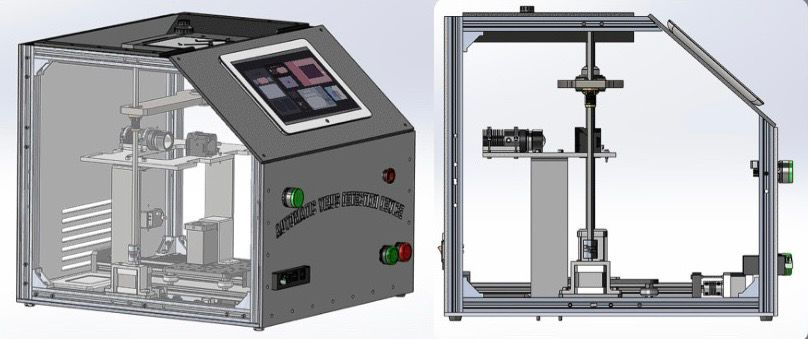

<h1 align="center">Hi 👋, I'm Hassan</h1>
<h3 align="center">AI ENGINEER</h3>

 
   

---

### 👨‍💻 About Me:
- 📋 **Resume**: Check out My Resume [**here**](https://drive.google.com/file/d/1jQOn-jON4HmUQeJn2lk8e6SJIzrS78De/view?usp=sharing)  
- 💬 **Ask me about**: , Data Science, Machine Learning, Deep Learning,Computer Vision , NLP 
- 📫 **Reach me at**: [hassanraof404@gmail.com](mailto:hassanraof404@gmail.com) | **+20 1115617479**  

---

<h3 align="left">🌐 Connect with me:</h3>

  
  
  

 

### 🎓 Education

---

#### 🏫 **Bachelor of Engineering , Mechatronics Department**

- 
- 
- 
- 

---

 

# 💼 Experience

---

## 🟠 AI Intern  
**Orange Digial Center**  
**Sep 2024 - Present** ( 2 months)  
**Location:** Cairo  

**Key Responsibilities:**
- Developing my understanding of foundational and advanced concepts in machine learning and deep learning, focuses on mathematical foundations, optimization techniques, and data analysis, providing hands-on experience in model evaluation, tuning, and pipeline development. I am gaining insights into various machine learning methods and their applications, while developing proficiency in deep learning frameworks. This experience equips me with the practical skills and theoretical knowledge necessary to effectively address real world AI challenges.

       

---

## 🖥️ AI & Data Scientist
**Digital Egypt Pioneers Initiative**  
**Oct 2024 - Present** (6 months)  
**Location:** CLS Comany Cairo

**Key Responsibilities:**
 - Gained a thorough understanding of Data Science fundamentals, including:
 - The principles of Data Science and its applications in various industries.
 - Tools and methodologies essential for Data Science projects.
 - Proficiency in Python for Data Science, AI, and development, including hands-on projects that reinforce learning.
 - Expertise in Databases and SQL for Data Science, enhancing data manipulation and retrieval skills.
 - Data analysis and visualization techniques using Python libraries, such as pandas and Matplotlib.
 - Implementation of machine learning algorithms with Python, fostering a practical understanding of model development.
 - Experience with MLOps tools, including MLflow and Hugging Face, culminating in an Applied Data Science Capstone project that integrates learned concepts.

       

---

## 🖥️ Machine Learning Intern  
**Code Alpha** · *Remote*  
**Aug 2024 - Present** (3 month)  

**Key Responsibilities:**
- Participate in the full machine learning lifecycle, from data collection and preprocessing to model training, evaluation, and deployment
- Contribute to the development of cutting-edge AI/ML solutions for real-world problems across various domains
- Assist in the design and implementation of efficient, scalable, and robust machine learning pipelines
- Perform exploratory data analysis, feature engineering, and model selection to optimize model performance

 

)

---

## 🧑‍💻 Machine Learning Intern  
**Ministry of Communications and Information Technology (MCIT), Egypt** · *Remote*  
**Oct 2022 - Dec 2022** (2 month) 

**Key Responsibilities:**
- Gained hands-on experience in supervised learning techniques to address real-world problems. 
- Explored various machine learning methods, focusing on the underlying mathematics and 
implementation strategies and enhancing problem-solving skills in model evaluation and optimization. 

 

 

# 📊 Projects 

---

## 💼 AI Virus Detection Device - Graduation Project 

**Description:**  
🚀 Developed an AI-powered analytical device to detect viral infections in biological samples
using isotachophoresis to extract and concentrate viral RNA in a micro-channel made of
Polydimethylsiloxane. The device utilizes light signals from probes reacting with the virus and employs
computer vision techniques to determine infection levels. A user-friendly tablet interface was also
developed for interaction with the device.

**Key Responsibilities:**
I focused on the computer vision system, which involved: 
- Founding a pattern for the model to detect virus from
- Generating a dataset from scratch
- Training the detection model using YOLOv8 with transfer learning.
- Evaluating the model's performance on a test set to ensure real-world applicability.

  [  

---

## 🚗 Advanced Techniques in Used Car Price Prediction
**🏆Kaggle Competition**

**Description:**  
🔍 Developed a predictive model for vehicle pricing using advanced data preprocessing and evaluation techniques. Employed algorithms like LightGBM and CatBoost, utilizing KFold Cross-Validation and metrics such as RMSE and MAE for robust performance assessment. Enhanced model explainability with SHAP Analysis.

  
  

**Tools & Technologies:**  
 
 
 
 
 

---

## 🎬 Movie Recommender System

**Description:**  
🔍 developed a Movie Recommender System that utilizes machine learning to help users discover films based on their preferences. Key methodologies include data collection from the TMDb dataset, preprocessing using CountVectorizer for text transformation, and implementing cosine similarity for recommendations. The user-friendly interface is built with Streamlit, allowing dynamic movie selection and poster fetching for an engaging experience.

  

**Tools & Technologies:**  
 
 

---

## 💳 Customer Segmentation

**Description:**  
-developed a Customer Segmentation project to identify distinct customer groups based on purchasing behavior. Key steps included data preprocessing, feature scaling, and using the elbow method to determine the optimal number of clusters (k) then implementing K-Means, Hierarchical clustering, and DBSCAN algorithms for segmentation. To visualize the results, I applied Principal Component Analysis (PCA) and evaluated the models using the Silhouette Score

**Tools & Technologies:**  
 
 
 
 
 

---

## 🚪🏃‍♂️ Telco customer churn 

**Description:**  
Developed a predictive model for customer churn using XGBoost by importing and preprocessing data, handling outliers and missing values, performing feature engineering, oversampling imbalanced data, and optimizing with Grid Search. Evaluated model performance with a confusion matrix to identify at-risk customers effectively.

  

**Tools & Technologies:**  
    

---

## 🎥 Housing Prices in Egypt 

**Description:**  
Developed a predictive modeling project focused on housing prices in Egypt using a stacking ensemble approach. The project involved data collection, preprocessing, and exploratory data analysis (EDA) to uncover key insights. Implemented feature engineering and trained multiple base models, culminating in a stacking ensemble that enhanced predictive accuracy. Evaluated model performance using metrics such as Mean Absolute Error (MAE), demonstrating proficiency in advanced machine learning techniques and data-driven decision-making.

  

**Tools & Technologies:**  
   

---

## 🛒 Market Basket Analysis

**Description:**  
Conducted a market basket analysis to uncover purchasing patterns using association rule mining. Implemented the Apriori algorithm to identify frequent itemsets and generate association rules. Evaluated rules based on metrics such as support, confidence, and lift to derive actionable insights for enhancing product placement and promotional strategies.

  

**Tools & Technologies:**  
 [Pandas](https://img.shields.io/badge/Pandas-150458?style=flat&logo=pandas&logoColor=white)  

 

# 🏅 Certifications

## 🚀 Machine Learning & Data Science

- **[Machine Learning Specialization](#)**  
  *Issued Feb 2023 - DeepLearning.AI*  
  

- **[Machine Learning Engineer (MLOps)](#)**  
  *Issued Aug 2024 - DataCamp*  
  

- **[The Machine Learning Process A-Z](#)**  
  *Issued Nov 2023 - 365 Data Science*  
  

- **[Deep Learning Specialization](#)**  
  *Issued Mar 2023 - DeepLearning.AI*  
  

- **[IBM AI Engineering Professional](#)**  
  *Issued Apr 2023 - Coursera*  
    
  

- **[TensorFlow Professional](#)**  
  *Issued Apr 2023 - DeepLearning.AI*  
  

- **[Machine Learning with Decision Trees and Random Forests](#)**  
  *Issued Nov 2023 - 365 Data Science*  
  
  

## 📊 Data Analysis & Visualization

- **[Google Data Analytics Professional](#)**  
  *Issued Apr 2023 - Google*  
    
  

- **[Data Analysis with Python](#)**  
  *Issued Feb 2023 - freeCodeCamp*  
  

- **[Advanced Microsoft Excel](#)**  
  *Issued Nov 2023 - 365 Data Science*  
  

- **[Building Business Reports Using Power BI](#)**  
  *Issued Nov 2023 - 365 Data Science*  
  

## 🧮 Mathematics & Statistics

- **[Mathematics](#)**  
  *Issued Nov 2023 - 365 Data Science*  
  

- **[Statistics](#)**  
  *Issued Nov 2023 - 365 Data Science*  
  

- **[Probability](#)**  
  *Issued Nov 2023 - 365 Data Science*  
  

- **[Calculus for Machine Learning and Data Science](#)**  
  *Issued Feb 2023 - DeepLearning.AI*  
  

- **[Linear Algebra for Machine Learning and Data Science](#)**  
  *Issued Feb 2023 - DeepLearning.AI*  
  

## 🛠️ Data Engineering

- **[Associate Data Engineer in SQL](#)**  
  *Issued Jul 2024 - DataCamp*  
    
  

## 📈 Communication & Strategy

- **[Communication and Presentation Skills for Analysts and Managers](#)**  
  *Issued Nov 2023 - 365 Data Science*  
  

- **[Data Strategy](#)**  
  *Issued Nov 2023 - 365 Data Science*  
  

---

  
 

  
  <!-- Languages Card -->
  

    <h3>Top Languages</h3>
    
  

  
  <!-- Stats Card -->
  

    <h3>GitHub Stats</h3>
    
  

  
  <!-- Streak Stats -->
  

    <h3>Current Streak</h3>
    
  

<!--
**HassanRaof/HassanRaof** is a ✨ _special_ ✨ repository because its `README.md` (this file) appears on your GitHub profile.

Here are some ideas to get you started:

- 🔭 I’m currently working on ...
- 🌱 I’m currently learning ...
- 👯 I’m looking to collaborate on ...
- 🤔 I’m looking for help with ...
- 💬 Ask me about ...
- 📫 How to reach me: ...
- 😄 Pronouns: ...
- ⚡ Fun fact: ...
-->
