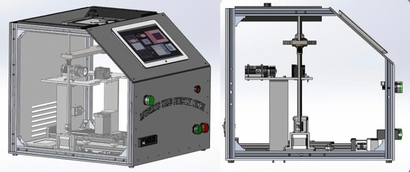

<h1 align="center">Hi 👋, I'm Hassan</h1>
<h3 align="center">AI ENGINEER</h3>

 
   

---

### 👨‍💻 About Me:
- 📋 **Resume**: Check out My Resume [**here**](https://drive.google.com/file/d/1jQOn-jON4HmUQeJn2lk8e6SJIzrS78De/view?usp=sharing)  
- 💬 **Ask me about**:Machine Learning, Deep Learning,Computer Vision,LLMS,RAG 
- 📫 **Reach me at**: [hassanraof404@gmail.com](mailto:hassanraof404@gmail.com) | **+20 1115617479**  

---

<h3 align="left">🌐 Connect with me:</h3>

  
  
  

 

### 🎓 Education

---

#### 🏫 **Bachelor of Engineering , Mechatronics Department**

- 
- 
- 
- 

---

 

# 💼 Experience

---

## 🔵 AI/ML Engineer  
**Upwork · Freelance**  
**Dec 2024 – Present** (1 yr 5 mos)  
**Location:** Remote  

**Key Responsibilities:**
- Collaborated with diverse clients on predictive modeling and intelligent system design projects.  
- Focused on aligning solutions with client goals, ensuring high-quality deliverables and timely completion.  
- Built models that enhanced business processes through automation and data-driven insights.  

      

---

## 🟢 AI Engineer  
**PYTHON WATER · Full-time**  
**Jan 2025 – May 2025** (5 mos)  
**Location:** United States · Remote  

**Company:** Early-stage startup focused on AI-powered hydration monitoring.  

**Key Responsibilities:**
- Designed and deployed ML models to analyze real-time sensor data from wearables and IoT devices for hydration tracking.  
- Owned the end-to-end data pipeline: data collection, preprocessing, and time-series modeling for predicting hydration behavior.  
- Delivered AI-driven features for estimating last water intake and generating personalized hydration insights.  

 
      

---

## 🟠 AI Intern  
**Orange Digial Center**  
**Sep 2024 - Dec 2024** ( 2 months)  
**Location:** Cairo  

**Key Responsibilities:**
- Developed my understanding of foundational and advanced concepts in machine learning and deep learning, focused on mathematical foundations, optimization techniques, and data analysis, provided hands-on experience in model evaluation, tuning, and pipeline development. I have gained insights into various machine learning methods and their applications, while developed proficiency in deep learning frameworks.
- Gained hands-on experience in NLP, Computer Vision, Generative AI, and MLOps, including developing sentiment analysis models, object detection systems, GANs, and deploying scalable AI solutions with MLOps best practices.

 
 
 
 
  
 
 
 
  
 
 
 

---

## 🖥️ AI & Data Scientist
**Digital Egypt Pioneers Initiative**  
**Oct 2024 - Apr 2025** (6 months)  
**Location:** CLS Comany Cairo

**Key Responsibilities:**
 - Gained a thorough understanding of Data Science fundamentals, including:
 - The principles of Data Science and its applications in various industries.
 - Tools and methodologies essential for Data Science projects.
 - Proficiency in Python for Data Science, AI, and development, including hands-on projects that reinforce learning.
 - Expertise in Databases and SQL for Data Science, enhancing data manipulation and retrieval skills.
 - Data analysis and visualization techniques using Python libraries, such as pandas and Matplotlib.
 - Implementation of machine learning algorithms with Python, fostering a practical understanding of model development.
 - Experience with MLOps tools, including MLflow and Hugging Face, culminating in an Applied Data Science Capstone project that integrates learned concepts.

       

---

## 🖥️ Machine Learning Intern  
**Code Alpha** · *Remote*  
**Aug 2024 - Present** (3 month)  

**Key Responsibilities:**
- Participate in the full machine learning lifecycle, from data collection and preprocessing to model training, evaluation, and deployment
- Contribute to the development of cutting-edge AI/ML solutions for real-world problems across various domains
- Assist in the design and implementation of efficient, scalable, and robust machine learning pipelines
- Perform exploratory data analysis, feature engineering, and model selection to optimize model performance

 

)

---

## 🧑‍💻 Machine Learning Intern  
**Ministry of Communications and Information Technology (MCIT), Egypt** · *Remote*  
**Oct 2022 - Dec 2022** (2 month) 

**Key Responsibilities:**
- Gained hands-on experience in supervised learning techniques to address real-world problems. 
- Explored various machine learning methods, focusing on the underlying mathematics and 
implementation strategies and enhancing problem-solving skills in model evaluation and optimization. 

 

 

# 📊 Projects 

---

# Graduation Project 

---

## 🦠 AI Virus Detection Device 

**Description:**  
🚀 Developed an AI-powered analytical device to detect viral infections in biological samples
using isotachophoresis to extract and concentrate viral RNA in a micro-channel made of
Polydimethylsiloxane. The device utilizes light signals from probes reacting with the virus and employs
computer vision techniques to determine infection levels. A user-friendly tablet interface was also
developed for interaction with the device.

**Key Responsibilities:**
I focused on the computer vision system, which involved: 
- Founding a pattern for the model to detect virus from
- Generating a dataset from scratch
- Training the detection model using YOLOv8 with transfer learning.
- Evaluating the model's performance on a test set to ensure real-world applicability.

    

---

# Machine Learning & DataScience 

---

## 🚗 Advanced Techniques in Used Car Price Prediction
**🏆Kaggle Competition**

**Description:**  
🔍 Developed a predictive model for vehicle pricing using advanced data preprocessing and evaluation techniques. Employed algorithms like LightGBM and CatBoost, utilizing KFold Cross-Validation and metrics such as RMSE and MAE for robust performance assessment. Enhanced model explainability with SHAP Analysis.

  
  

**Tools & Technologies:**  
 
 
 
 
 

---

## 🎬 Movie Recommender System

**Description:**  
🔍 developed a Movie Recommender System that utilizes machine learning to help users discover films based on their preferences. Key methodologies include data collection from the TMDb dataset, preprocessing using CountVectorizer for text transformation, and implementing cosine similarity for recommendations. The user-friendly interface is built with Streamlit, allowing dynamic movie selection and poster fetching for an engaging experience.

  

**Tools & Technologies:**  
 
 

---

## 💳 Customer Segmentation

**Description:**  
-developed a Customer Segmentation project to identify distinct customer groups based on purchasing behavior. Key steps included data preprocessing, feature scaling, and using the elbow method to determine the optimal number of clusters (k) then implementing K-Means, Hierarchical clustering, and DBSCAN algorithms for segmentation. To visualize the results, I applied Principal Component Analysis (PCA) and evaluated the models using the Silhouette Score

**Tools & Technologies:**  
 
 
 
 
 

---

## 🚪🏃‍♂️ Telco customer churn 

**Description:**  
Developed a predictive model for customer churn using XGBoost by importing and preprocessing data, handling outliers and missing values, performing feature engineering, oversampling imbalanced data, and optimizing with Grid Search. Evaluated model performance with a confusion matrix to identify at-risk customers effectively.

  

**Tools & Technologies:**  
    

---

## 🎥 Housing Prices in Egypt 

**Description:**  
Developed a predictive modeling project focused on housing prices in Egypt using a stacking ensemble approach. The project involved data collection, preprocessing, and exploratory data analysis (EDA) to uncover key insights. Implemented feature engineering and trained multiple base models, culminating in a stacking ensemble that enhanced predictive accuracy. Evaluated model performance using metrics such as Mean Absolute Error (MAE), demonstrating proficiency in advanced machine learning techniques and data-driven decision-making.

  

**Tools & Technologies:**  
   

---

## 🛒 Market Basket Analysis

**Description:**  
Conducted a market basket analysis to uncover purchasing patterns using association rule mining. Implemented the Apriori algorithm to identify frequent itemsets and generate association rules. Evaluated rules based on metrics such as support, confidence, and lift to derive actionable insights for enhancing product placement and promotional strategies.

**Tools & Technologies:**  
   

---

## 🌒 Deep Q-Learning for Lunar Lander: A Reinforcement Learning Approach

**Description:**  
Developed a Deep Q-Learning model to solve the Lunar Lander environment, employing techniques such as experience replay and target networks to optimize the learning process. The project involved data collection through simulation, state-action value function approximation via neural networks, and policy improvement based on Q-learning principles.

**Tools & Technologies:**  
   

---

## 💰🙏 Finding Donors for CharityML 

**Description:**  
- developed a predictive model to identify individuals earning over $50,000 annually using 1994 U.S. Census data. The project involves data collection, exploration, and preprocessing, including normalizing features and encoding categorical variables. Various supervised learning algorithms are implemented and evaluated for accuracy. The best-performing model is then optimized through hyperparameter tuning to enhance predictive accuracy, aiding non-profits in effectively targeting potential donors.

**Tools & Technologies:**  
   

---
# 📈 DeepLearning 

---

## 🧠 Brain Stroke Classification | Transfer Learning

**Description:**  
- Developed a robust brain stroke classification model utilizing transfer learning techniques on a dataset of MRI images. Implemented convolutional neural networks (CNNs) including DenseNet121, ResNet50, and Xception to enhance predictive accuracy. Employed ensemble learning strategies to combine model outputs, achieving high performance metrics such as precision, recall, and F1-score. The project demonstrated the effectiveness of deep learning in medical diagnostics, providing insights for early stroke detection and intervention.

**Tools & Technologies:**  
 
 
 
 
 
 
 

---

## 🖼️🔍 Images Denoising | Auto Encoders

**Description:**  
- Developed an application of autoencoders for denoising medical images, focusing on enhancing image quality through unsupervised learning techniques. By training a convolutional autoencoder on noisy medical images, the model effectively learns to reconstruct clean images, thereby improving diagnostic accuracy and aiding in medical image analysis. The project includes data preprocessing, model architecture design, training, and evaluation metrics, showcasing the potential of deep learning in improving medical imaging outcomes.

**Tools & Technologies:**  
 
 
 
 
 
 
 

---

## 💬 Sentiment Analysis | LSTM 

**Description:**  
- Developed a high-accuracy sentiment analysis model using Long Short-Term Memory (LSTM) networks on a dataset of textual reviews. The model incorporates advanced preprocessing techniques, embedding layers, and dropout layers to prevent overfitting. Achieved an impressive accuracy of 98% through rigorous training and hyperparameter tuning. This project highlights the capabilities of deep learning in natural language processing, providing valuable insights into customer sentiment.

**Tools & Technologies:**  
 
 
 
 
 
 
 

---

## 🌐 Machine Translation | Seq2Seq

**Description:**  
- Developed a state-of-the-art machine translation model utilizing Sequence-to-Sequence (Seq2Seq) architecture on a bilingual dataset. Implemented attention mechanisms to improve translation quality and handle long sequences effectively. The project achieved significant accuracy in translating sentences, showcasing the potential of deep learning in natural language processing and cross-linguistic communication.

**Tools & Technologies:**  
 
 
 
 
 

---

## 📚 Fine-Tuning a Masked Language Model   

**Description:**  
- Developed and fine-tuned a custom Masked Language Model (MLM) using encoder-only transformer architectures (RoBERTa/DistilBERT) for domain-specific text understanding.  
- The model predicts masked tokens by leveraging bidirectional context, enabling deep semantic representation learning.  
- Applied the approach on a specialized text corpus to improve contextual comprehension and downstream NLP performance.  

[](https://colab.research.google.com/#fileId=https%3A//storage.googleapis.com/kaggle-colab-exported-notebooks/hassanraof/fine-tuned-a-masked-lm.14dc19bd-212b-471f-a78f-2287aef8e6d6.ipynb%3FX-Goog-Algorithm%3DGOOG4-RSA-SHA256%26X-Goog-Credential%3Dgcp-kaggle-com%2540kaggle-161607.iam.gserviceaccount.com/20260424/auto/storage/goog4_request%26X-Goog-Date%3D20260424T231304Z%26X-Goog-Expires%3D259200%26X-Goog-SignedHeaders%3Dhost%26X-Goog-Signature%3D784bb1f6d338bdc823b330c82174e38c2843cbb702574d50b872bf93e2ac52fa3f6f93e252f8fb17ae0e67be3ce2fc155cb41b4e3c9cff96c5fa3ef3dae14130600aca34089eaa6b6bbe39b876bc5d15ba6070f7215708f3b38522303abcf9188ce409ccc4b266f00048eed1e7181aebc187a4f5010b71202a9d026d3661d8f1174e6f9b60b183e2cba34fa5c240b88cb6d55246a90440065decf4c75b425a01ca159069588f185bd3eb945edd21cd4416c9b2c8c84625da732b3e66b8e5592821d1abc140a3abbfaf2a26c40e5f99d8082f610ff04a40a513f5ebd29b58e298e93783f2232a21c5bb09f2fe81f0dd94ec9c6ff170787dbaa916deb671693bf1)

**Tools & Technologies:**  
     
  

 

# 🏅 Certifications

## 🚀 AI

- **[Machine Learning Specialization](#)**  
  *Issued Oct 2024 - DeepLearning.AI*  
  

- **[Machine Learning Cross Skilling](#)**  
  *Issued Oct 2022 - MCIT*  
  

- **[Deep Learning](#)**  
  *Issued Oct 2023 - DeepLearning.AI*  
  
  

## 📊 Data Analysis & Visualization

- **[Data Cleaning & Preprocessing with Pandas](#)**  
  *Issued Nov 2022 - 365 Data Science*  
  

- **[NumPy for Data Science](#)**  
  *Issued Nov 2022 - 365 Data Science*  
  

## 🧮 Mathematics & Statistics

- **[Mathematics](#)**  
  *Issued Nov 2023 - 365 Data Science*  
  

- **[Statistics](#)**  
  *Issued Nov 2023 - 365 Data Science*  
  

- **[Probability](#)**  
  *Issued Nov 2023 - 365 Data Science*  
  

- **[Calculus for Machine Learning and Data Science](#)**  
  *Issued Feb 2023 - DeepLearning.AI*  
  

- **[Linear Algebra for Machine Learning and Data Science](#)**  
  *Issued Feb 2023 - DeepLearning.AI*  
  

---

  

<!--
**HassanRaof/HassanRaof** is a ✨ _special_ ✨ repository because its `README.md` (this file) appears on your GitHub profile.

Here are some ideas to get you started:

- 🔭 I’m currently working on ...
- 🌱 I’m currently learning ...
- 👯 I’m looking to collaborate on ...
- 🤔 I’m looking for help with ...
- 💬 Ask me about ...
- 📫 How to reach me: ...
- 😄 Pronouns: ...
- ⚡ Fun fact: ...
-->
